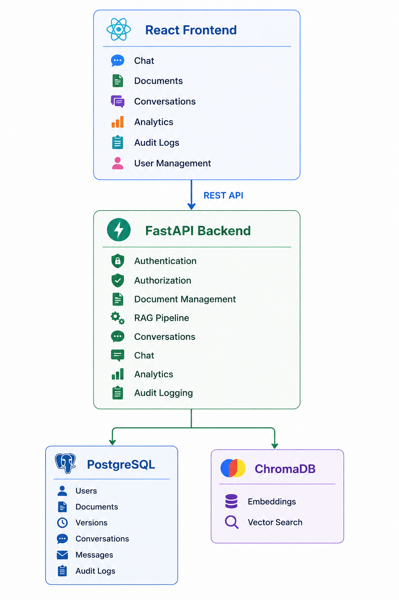
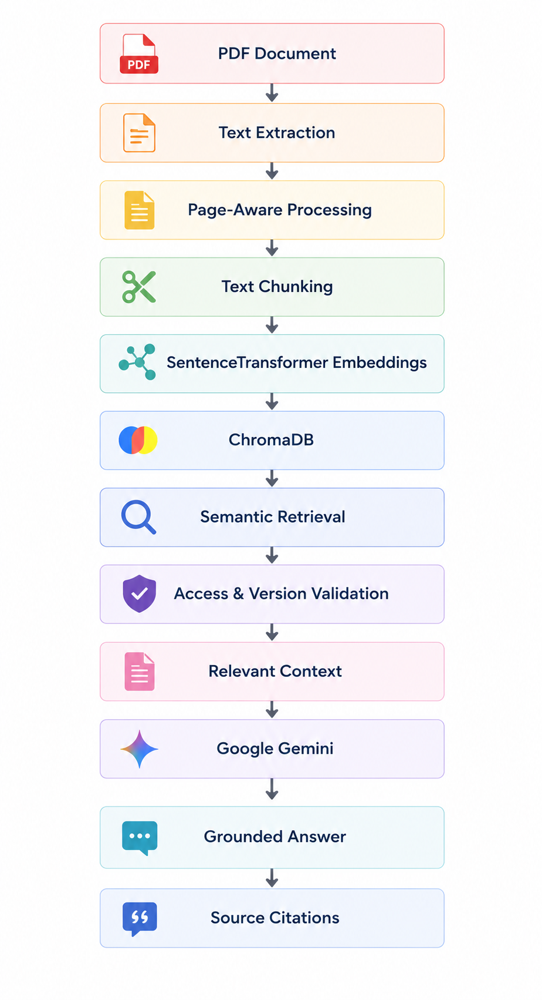
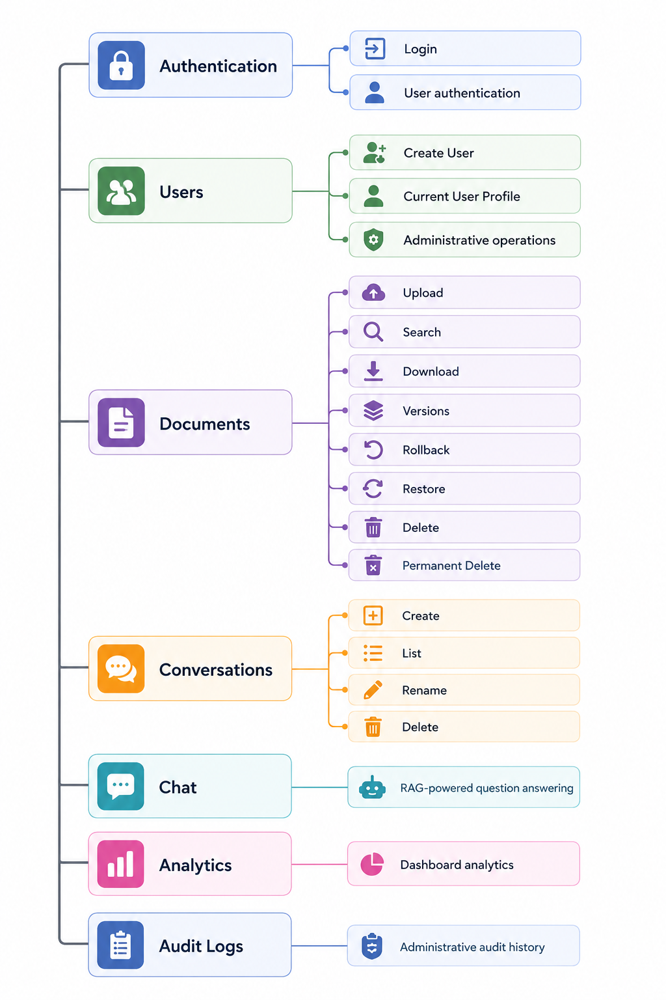
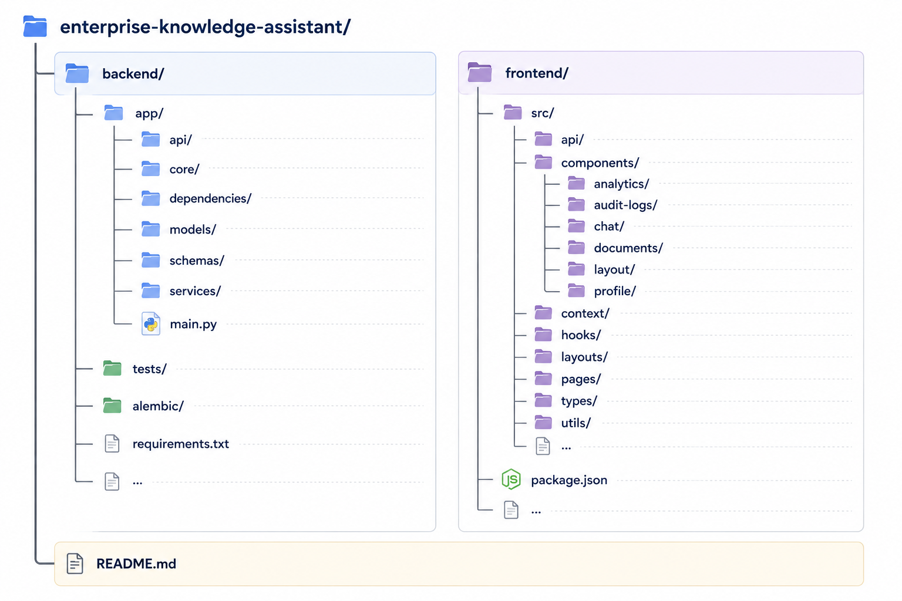
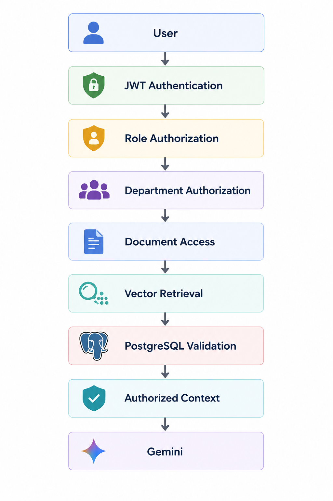

# Enterprise Knowledge Assistant

A production-style, multi-user AI knowledge platform that transforms organizational documents into a secure, searchable knowledge base using Retrieval-Augmented Generation (RAG).

The platform allows organizations to securely upload and manage documents, control access by department and user role, search organizational knowledge using semantic retrieval, and interact with documents through context-aware AI conversations.

## Highlights

- Enterprise Retrieval-Augmented Generation (RAG)
- Secure JWT Authentication
- Role-Based Access Control (RBAC)
- Department Level Access Control
- Multi-User Conversation Management
- Persistent Conversation History
- Context Aware Follow-Up Questions
- PDF Document Management
- Document Version Control
- Version Rollback
- Recycle Bin and Document Restoration
- Permanent Document Deletion
- Semantic Search with ChromaDB
- Google Gemini Integration
- Page Level Source Citations
- Admin Analytics Dashboard
- Audit Logging
- Enterprise Document Search
- Document Filtering, Sorting, and Pagination
- Secure Document Downloads
- React Based Admin Frontend
- Dockerized Backend
- Automated Backend Integration Tests
- 24 Automated Tests

## Project Overview
Enterprise Knowledge Assistant is designed to solve a common organizational problem: important knowledge is often distributed across internal documents and difficult to retrieve efficiently.

The platform combines document management, semantic search, vector retrieval, and generative AI to allow authorized users to ask questions about organizational documents and receive answers grounded in retrieved document content.

The system currently supports PDF documents and provides an end to end workflow from document ingestion to AI powered question answering.

### Core capabilities

- Secure authentication and authorization
- Department-based document access control
- PDF ingestion and text extraction
- Page-aware document chunking
- Vector embedding generation
- Semantic document retrieval
- Retrieval-Augmented Generation
- Context-grounded AI responses
- Page-level source citations
- Multi-turn conversational memory
- Persistent conversation history
- Document version management
- Version rollback
- Recycle Bin and restoration
- Permanent deletion
- Audit logging
- Enterprise document search
- Document filtering and sorting
- Server-side document pagination
- Secure document downloads
- Administrative analytics
- Automated integration testing

# System Architecture



# Authentication and Authorization

The platform uses JWT-based authentication and role-based authorization.

## Authentication
- User registration
- User login
- JWT access tokens
- Protected API endpoints
- Current-user profile endpoint

Roles
The system currently supports:
- Administrator
- Employee

## Authorization

Administrative operations are protected using role-based dependencies.

Department-level authorization is also used to ensure users only retrieve documents they are authorized to access.

# Enterprise Document Management

The document management module provides a complete document lifecycle.

## Document Features
- Secure PDF upload
- Department assignment
- PostgreSQL document metadata storage
- Unique document identifiers
- Document group identifiers
- Processing status tracking
- Latest version document listing
- Department-restricted document access
- Secure document downloads
- Filename search
- Sorting
- Filtering
- Pagination

## Document Status
Documents can have processing states such as:
- READY
- PROCESSING
- FAILED

## Document Search

The document management interface provides enterprise-style search and filtering.

Supported capabilities include:

- Case-insensitive filename search
- Department filtering
- Uploader filtering
- Status filtering
- Server-side pagination
- Total result count
- Total page count
- Sorting by upload date
- Sorting by filename
- Sorting by version
- Ascending ordering
- Descending ordering

The backend performs pagination before returning results to the frontend, allowing the system to scale better as the number of documents grows.

## Document Version Control

Documents are organized into document groups and maintain complete version history.

Users can:

- Upload new document versions
- View version history
- Download versions
- Roll back to previous versions
- Preserve historical versions
- Maintain a latest active version

A rollback does not overwrite the historical document.

Instead, the selected historical version is copied into a new latest version.

Example:

V1 → Original document
V2 → Updated document
V3 → Rollback copy of V1

The RAG pipeline uses the latest active version.

## Document Lifecycle Management

The platform supports a complete document lifecycle.

- Soft Delete

Documents can be moved to a Recycle Bin without immediately removing their data.

- Restore

Deleted document families can be restored.

- Permanent Delete

Permanent deletion removes:

Physical document files
PostgreSQL document records
Associated document versions
ChromaDB vectors

This prevents deleted documents from remaining accessible through semantic retrieval.

# Retrieval Augmented Generation (RAG)

The core AI functionality is implemented using a Retrieval Augmented Generation architecture.


## RAG Pipeline
The pipeline includes:
- PDF text extraction
- Page-aware document processing
- Overlapping text chunking
- SentenceTransformer embeddings
- ChromaDB vector storage
- Semantic similarity retrieval
- Retrieval candidate filtering
- Duplicate chunk removal
- Document authorization validation
- Latest-version validation
- Department-aware retrieval
- Gemini-powered answer generation
- Strict document-grounded prompting

## Retrieval Security
The RAG pipeline does not blindly trust retrieved vector results.

Retrieved document IDs are validated against PostgreSQL before their content is provided to the language model.
This allows the system to prevent:
- Deleted documents from being retrieved
- Outdated document versions from being used
- Unauthorized departmental documents from being accessed
- Historical inactive versions from being used
- Invalid document references from entering the generation context

This provides an additional authorization layer between vector retrieval and AI generation.

## Page Aware Source Citations

AI responses can provide references back to the source documents used during retrieval.

A source can contain:
- Document ID
- Filename
- Document version
- PDF page number
- Chunk index

Example:

Source
HR Policy.pdf
Page 12
Version 3
Chunk 4

This allows users to trace generated answers back to the original organizational knowledge.

# Conversations and Chat History

The platform provides persistent multi-user conversations.

Users can:

- Create conversations
- View conversations
- Rename conversations
- Delete conversations
- View complete conversation history
- Send multiple messages within a conversation

The system stores:

- User messages
- Assistant responses
- Retrieved RAG sources
- Conversation metadata

Conversation data is persisted in PostgreSQL.

## Context Aware Follow-Up Questions

The chat system supports multi-turn conversations.

For example:

User:
What is the maternity leave policy?

Assistant:
...

User:
How long is it?

Instead of treating the second question as an unrelated query, the system uses recent conversation context to rewrite the follow-up question into a standalone retrieval query.

The original user question is preserved for the final response while the rewritten query improves document retrieval.


# Admin Analytics Dashboard

Administrators have access to a dedicated analytics dashboard.

The dashboard provides:

Overview
- Total users
- Active users
- Total documents
- Total document versions
- Total conversations
- Total messages
- Total chat queries

Document Analytics
- Documents by department
- Documents by status
- Recent document uploads

User Analytics
- Users by role
- Users by department

Chat Analytics
- Queries by department
- Most-used documents
- Recent chat queries

Recent Activity
- Recent audit activity
- User
- Action
- Resource
- Resource ID
- Timestamp

The analytics dashboard is restricted to administrators.

# Audit Logging

The platform maintains audit records for important system activities.

Tracked activities include:
- Document uploads
- Document version creation
- Document rollbacks
- Soft deletions
- Document restoration
- Permanent deletion
- Chat queries

Each audit record can contain:
- Audit ID
- User ID
- User Email
- Action
- Resource Type
- Resource ID
- Action Details
- Timestamp

Administrators can view audit logs through the dedicated Audit Logs interface.

The frontend provides:
- Search
- Action filtering
- Resource filtering
- Pagination-style navigation
- Refresh functionality
- Audit statistics

# Frontend Application

The frontend is implemented using React and provides a complete administrative and user-facing interface.

Main Frontend Areas
- Authentication
- Dashboard
- Chat
- Conversation Sidebar
- Document Management
- Document Upload
- Document Details
- Document Versions
- Version History
- Rollback
- Recycle Bin
- User Management
- User Profiles
- Workspace/Department Selection
- Analytics Dashboard
- Audit Logs

UI Features
- Responsive layouts
- Dark enterprise interface
- Sidebar navigation
- Collapsible sidebar
- Modal dialogs
- Dropdown menus
- Search interfaces
- Data tables
- Pagination
- Status indicators
- Loading and error states
- Source reference cards
- Interactive analytics charts

# Profile
The application provides user profile and workspace interfaces.

Profile

The profile interface displays:
- Full name
- Email
- Department
- Role
- User ID

The top-right profile menu provides quick access to the user's profile.
The sidebar profile entry opens the same full profile interface.

# Technology Stack
Backend
- Python
- FastAPI
- SQLAlchemy
- Pydantic
- Alembic

Database
- PostgreSQL

Infrastructure
- Docker
- Docker Compose

AI and RAG
- Google Gemini API
- SentenceTransformers
- ChromaDB
- PyMuPDF

Authentication and Security
- JWT Authentication
- Role-Based Access Control
- Department-Based Authorization

Frontend
- React
- TypeScript
- Vite
- Tailwind CSS
- Axios
- React Router
- Recharts
- Lucide React

Testing
- Pytest
- pytest-mock
- FastAPI TestClient

# Getting Started

## Prerequisites

Make sure the following are installed:

- Git
- Docker
- Docker Compose
- Node.js
- npm

## Clone the Repository

```bash
git clone https://github.com/safanailmy/enterprise-knowledge-assistant.git

cd enterprise-knowledge-assistant
```

## Start the Backend

The backend is containerized using Docker.

From the project root:
```bash
docker compose up --build
```
To run the backend in the background:
```bash
docker compose up -d --build
```

## Start the Frontend
Open a new terminal and navigate to the frontend:

```bash
cd enterprise-knowledge-assistant/frontend
```

Install frontend dependencies:
```bash
npm install
```

```bash
npm run dev
```

Stop the Backend
```bash
docker compose down
```

# API Structure
The backend exposes REST APIs for:


# Project structure


# Security Model
The system uses multiple security layers.


Authentication and authorization are enforced at the API level.

For RAG requests, retrieved document references are additionally validated against the relational database before being passed to the language model.

# Automated Testing

The backend includes automated integration tests using Pytest and FastAPI TestClient.

Current test coverage includes:

Health endpoint
Authentication
User APIs
Authorization
Conversation APIs
Document APIs
Chat APIs
Error handling

Mocked LLM responses are used where appropriate to provide deterministic AI testing without depending on external model responses.

## Current Test Status
24 Passed
0 Failed

Run the test suite with:
```python
pytest
```
# Future Multi-Format Knowledge Support

The ingestion architecture can be extended beyond PDF documents.
PDF
→ Page-aware extraction

Word
→ Document and section extraction

PowerPoint
→ Slide-aware extraction

Excel
→ Sheet and cell-range extraction

Images
→ OCR and visual text extraction

This would allow the platform to evolve into a unified enterprise knowledge base supporting multiple organizational content formats.

# Current Limitations

The core application functionality is implemented, while some secondary UI actions remain placeholders for future development.

Currently:

- Notification UI is present but does not yet have backend functionality.
- Settings UI is present but does not yet persist application settings.
- Logout functionality is planned for final integration with the    authentication/session flow.
- Workspace/department selection is currently frontend-only and is prepared for future backend integration.
- PDF is currently the supported document ingestion format.

These limitations do not affect the core document management, RAG, conversation, analytics, or audit logging workflows.

# Future Improvements

Potential future enhancements include:
- Real-time notifications
- Persistent notification center
- Complete settings management
- Profile editing
- Password change functionality
- Backend workspace/department switching
- Multi-format document ingestion
- OCR for scanned documents
- Advanced analytics filtering
- Exportable analytics reports
- Advanced audit-log filtering
- Additional RAG evaluation metrics
- Retrieval quality monitoring
- AI response evaluation
- Document ingestion queues
- Background processing workers
- Cloud object storage
- Production deployment automation

# Summary
The project demonstrates an end-to-end implementation of an enterprise RAG application, covering document ingestion, secure retrieval, AI generation, persistent conversations, document lifecycle management, administrative analytics, and auditability.